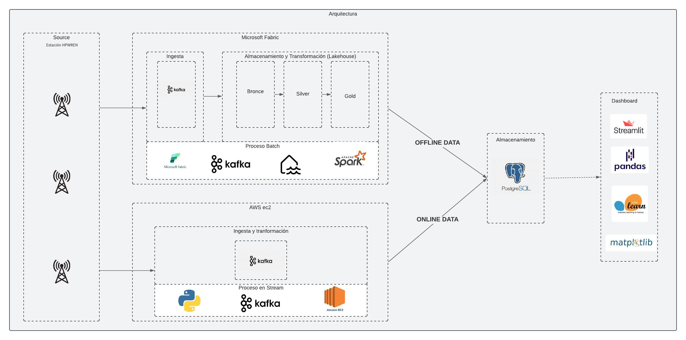

# Proyecto: Monitoreo Meteorológico en Tiempo Real para la Gestión Agrícola en San Diego, California - Datos de la Estación HPWREN (UCSD)
## 1. Introducción
La agricultura es una actividad importante para la economía de San Diego,  pero su sostenibilidad enfrenta desafíos significativos debido a las condiciones climáticas extremas. Fenómenos como vientos fuertes, heladas, sequías y lluvias intensas pueden ocasionar pérdidas considerables en la producción agrícola, impactando tanto a pequeños agricultores como a grandes productores. Ante este panorama, surge la necesidad de herramientas tecnológicas que permitan a los agricultores anticiparse a estas condiciones, optimizar recursos y minimizar riesgos.

El presente proyecto tiene como objetivo principal desarrollar una aplicación web que permita a los usuarios acceder e interactuar de forma sencilla con información meteorológica relevante. Para lograr este propósito, se crearán pipelines de datos que alimentarán un dashboard interactivo, el cual integrará datos meteorológicos en tiempo real, series temporales históricas y predicciones climáticas basadas en un modelo de machine learning.

Además, se implementará un sistema de suscripción para el envío de notificaciones de alertas meteorológicas, brindando a los agricultores información oportuna y personalizada. Con todos estos datos disponibles, los agricultores estarán mejor preparados para tomar decisiones informadas, optimizando recursos y reduciendo riesgos asociados a las condiciones climáticas extremas.

---
## 2. Objetivos del Proyecto

Los objetivos principales de este proyecto son:

2.1. **Desarrollar dos pipelines ETL:** Diseñar e implementar pipelines para la extracción, transformación y carga de datos meteorológicos proporcionados por la estación HPWREN (UCSD), optimizando tanto el procesamiento en tiempo real como el análisis de datos históricos.  
   - **ETL Streaming:** Procesar datos en tiempo real para proporcionar alertas y actualizaciones inmediatas.  
     - La ingesta y el procesamiento se realizan utilizando **Apache Kafka**.  
     - Los datos se almacenan en una base de datos **PostgreSQL**, garantizando accesibilidad para consultas rápidas y alertas críticas.  
   - **ETL Batch:** Procesar y almacenar grandes volúmenes de datos históricos para análisis a largo plazo y entrenamiento de modelos de *machine learning*.  
     - Los datos son extraido con **Apache Kafka** y almacenados en un **data lake**.  
     - Posteriormente, se procesan con **Apache Spark** y se cargan en una base de datos **PostgreSQL** para su análisis.  

2.2. **Implementar un dashboard interactivo:** Crear un dashboard visualmente intuitivo que permita a los agricultores:  
   - Acceder a información meteorológica en tiempo real.  
   - Analizar tendencias históricas mediante series temporales y patrones climáticos.  
   - Acceder a predicciones de clima extremo respaldadas por modelos de ML.
   - Suscripción para recibir notificaciones de alertas meteorológicas. 

2.3. **Desarrollar un sistema de notificaciones de alertas:** Incorporar un sistema de notificaciones personalizadas que envíe alertas meteorológicas específicas a los usuarios. Este sistema estará adaptado a las necesidades de cada agricultor, permitiendo reacciones oportunas frente a condiciones climáticas adversas, como heladas, granizo o vientos fuertes.  

2.4. **Implementar modelos de *machine learning* para predicciones climáticas:**  
   - Desarrollar modelos predictivos basados en datos históricos y actuales que permitan estimar la probabilidad de eventos climáticos extremos.  
   - Estos modelos ayudarán a identificar patrones de riesgo y mejorar la toma de decisiones estratégicas en la gestión agrícola.
---
## 3. Diseño de la solución

---
## 4 Arquitectura de Datos

4.1. **Fuentes de Datos (Source)**
- **Estación HPWREN**: Actúa como fuente de datos en tiempo real, recolectando datos de sensores en vivo.
  
4.2. **Proceso Batch**
- **Microsoft Fabric**:
   - **Ingesta de Datos**:
       - **Kafka**: Es utilizado para la ingesta de datos en tiempo real, asegurando que los datos provenientes de las estaciones sean capturados de manera eficiente.
   - **Almacenamiento y Transformación (Lakehouse)**:
     - **Bronze, Silver y Gold**: Modelo de capas para manejar los datos en diferentes niveles de calidad:
        - **Bronze**: Datos sin procesar.
        - **Silver**: Datos transformados y limpios.
        - **Gold**: Datos listos para análisis o consumo.
 - **Herramientas empleadas**:
   - **Kafka**: Para la transmisión y gestión de datos.
   - **Apache Spark**: Para realizar transformaciones en lote (batch) y procesamiento a gran escala.
     
4.3. **Proceso Streaming**
- **AWS EC2: Instancia de Ubuntu**
  - **Ingesta y Transformación**:
      - **Kafka**: Para manejar la ingesta de datos desde múltiples fuentes.
      - **Python**: Para ejecutar scripts personalizados para transformaciones específicas.

 - **Herramientas en Stream**:
   - **Kafka**: También se utiliza para procesar datos en tiempo real.
   - **AWS EC2**: Sirve como la infraestructura en la nube para ejecutar estas operaciones.

4.4. **Almacenamiento**
- **PostgreSQL**: Actúa como base de datos central para almacenar tanto los datos en tiempo real (online) como los datos procesados de forma batch (offline).

4.5. **Dashboard**
- **Herramientas utilizadas para visualizar los datos y generar informes**:
- **Streamlit**: Para desarrollar interfaces visuales interactivas.
- **Pandas**: Para manipulación de datos en Python.
- **Scikit-learn**: Para aplicar modelos de machine learning.
- **Matplotlib**: Para la creación de gráficos y visualizaciones.

**Flujo General**
-  1. Los datos son recolectados de las estaciones HPWREN.
-  2. **Kafka** los ingiere y distribuye hacia dos flujos:
      - Procesamiento en tiempo real (streaming) en **AWS EC2**.
      - Procesamiento batch en **Microsoft Fabric**.
-  3. Los datos procesados se almacenan en **PostgreSQL**.
-  4. Finalmente, se visualizan en dashboards construidos con herramientas como **Streamlit** y **Matplotlib**.

---
## 4 Evaluacion.

---
## 4.1 Claridad y Justificación del Proyecto

El proyecto "Monitoreo Meteorológico en Tiempo Real para la Gestión Agrícola - Datos de la Estación HPWREN (UCSD)" surge como una respuesta directa a los desafíos que enfrentan los agricultores de San Diego, California, debido a las condiciones climáticas extremas. Fenómenos como vientos fuertes, heladas, sequías y lluvias intensas representan riesgos significativos para la producción agrícola, impactando tanto la rentabilidad como la sostenibilidad del sector.

La agricultura en San Diego, aunque se desarrolla en gran medida en pequeñas explotaciones familiares, es una parte importante de la economía local. Con cultivos clave como aguacates, cítricos, fresas y flores ornamentales, la región enfrenta una creciente necesidad de soluciones tecnológicas que permitan mitigar el impacto de los eventos climáticos adversos. La falta de acceso a herramientas precisas de monitoreo y predicción limita la capacidad de los agricultores para anticipar riesgos, tomar decisiones informadas y optimizar recursos como el agua.

Este proyecto tiene como objetivo proporcionar una solución integral que permita a los agricultores acceder a información meteorológica en tiempo real, analizar datos históricos y recibir predicciones basadas en modelos de machine learning. Además, incorpora un sistema de alertas tempranas a través de notificaciones personalizadas, permitiendo a los usuarios reaccionar de manera oportuna a condiciones adversas.

La creación de pipelines de datos que alimenten un dashboard interactivo no solo facilitará el acceso a esta información, sino que también permitirá su visualización de manera intuitiva y comprensible. Esto ayudará a los agricultores a identificar patrones climáticos y planificar estrategias preventivas, promoviendo prácticas agrícolas sostenibles y reduciendo pérdidas.

En conclusión, este proyecto está plenamente justificado, ya que responde a una necesidad concreta del sector agrícola de San Diego. Al aprovechar tecnologías modernas como Apache Kafka, Spark y machine learning, se busca transformar los desafíos climáticos en oportunidades para mejorar la eficiencia, sostenibilidad y resiliencia del sector agrícola, beneficiando tanto a los agricultores como a la economía local.

---
